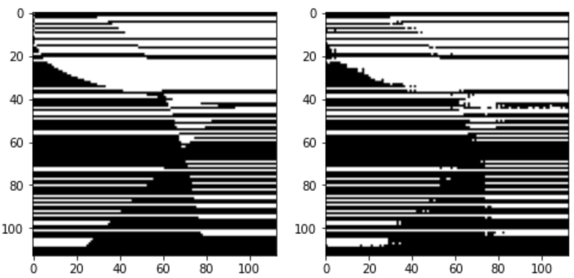

# Mechanistic Interpretability Challenge

## Challenge 1, MNIST CNN:

Use mechanistic interpretability tools to reverse engineer an MNIST CNN and send me a program for the labeling function it was trained on. 

Hint 1: The labels are binary.

Hint 2: The network gets 95.58% accuracy on the test set. 

Hint 3: This image may be helpful. 

MNIST CNN challenge:  

## Challenge 2, Transformer:

Use mechanistic interpretability tools to reverse engineer a transformer and send me a program for the labeling function it was trained on. 

Hint 1: The labels are binary.

Hint 2: The network is trained on 50% of examples and gets 97.27% accuracy on the test half. 

Hint 3: Here are the ground truth and learned labels. Notice how the mistakes the network makes are all near curvy parts of the decision boundary...

Transformer challenge:  

## Rewards:

If you send me one of the two labeling functions along with a mechanisic interpretability justification for it, I'll give you a prize (TBD) and sing your praises on twitter. 
